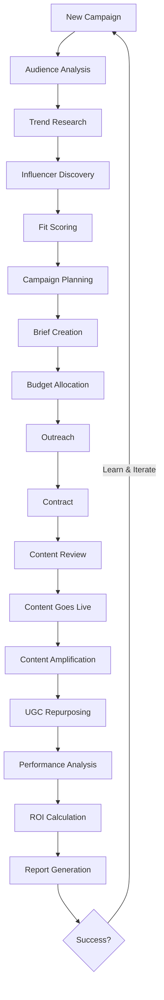

# Influencer Marketing Claude Skills

A comprehensive collection of Claude Skills for Influencer Marketing, organized around the proven IMPACT methodology framework.

## Methodology: I.M.P.A.C.T.

This skills library follows a systematic six-phase approach to influencer marketing:

```
┌─────────────────────────────────────────────────────────────────────────────────────────────┐
│                                                                                             │
│   ┌─────────┐   ┌───────┐   ┌────────┐   ┌──────────┐   ┌─────────┐   ┌─────────┐         │
│   │ INSIGHT │ → │  MAP  │ → │  PLAN  │ → │ ACTIVATE │ → │ CONVERT │ → │  TRACK  │         │
│   └─────────┘   └───────┘   └────────┘   └──────────┘   └─────────┘   └─────────┘         │
│        │            │            │             │              │             │               │
│        ▼            ▼            ▼             ▼              ▼             ▼               │
│   • Audience    • Discovery • Campaign    • Outreach     • Amplify    • Performance       │
│   • Trends      • Fit Score • Brief       • Content      • Repurpose  • ROI               │
│   • Niche       • Compete   • Budget      • Contract     • Landing    • Reports           │
│                                                                                             │
└─────────────────────────────────────────────────────────────────────────────────────────────┘
```

## What is the IMPACT Framework?

The IMPACT framework is a data-driven approach to influencer marketing that ensures every campaign is strategically planned, precisely executed, and thoroughly measured.

| Phase | Focus | Key Questions |
|-------|-------|---------------|
| **I**nsight | Understanding your market | Who is your audience? What trends matter? |
| **M**ap | Finding the right influencers | Who can reach your audience authentically? |
| **P**lan | Strategic campaign design | What content, budget, and timeline? |
| **A**ctivate | Executing partnerships | How to brief, manage, and collaborate? |
| **C**onvert | Maximizing impact | How to amplify and repurpose content? |
| **T**rack | Measuring success | What worked? What's the ROI? |

## Skills Overview

### 🔍 Insight Phase

Understand your market, audience, and opportunities before identifying influencers.

| Skill | Description | Primary Use |
|-------|-------------|-------------|
| [audience-analyzer](./insight/audience-analyzer/) | Deep-dive into target audience demographics, behaviors, and preferences | Define who you're trying to reach |
| [trend-spotter](./insight/trend-spotter/) | Identify trending topics, hashtags, and content formats | Ride relevant trends |
| [niche-researcher](./insight/niche-researcher/) | Analyze niche communities and their key voices | Find underserved opportunities |

### 🗺️ Map Phase

Discover and evaluate the right influencers for your brand.

| Skill | Description | Primary Use |
|-------|-------------|-------------|
| [influencer-discovery](./map/influencer-discovery/) | Find relevant influencers across platforms | Build influencer lists |
| [fit-scorer](./map/fit-scorer/) | Evaluate influencer-brand alignment | Prioritize partnerships |
| [competitor-tracker](./map/competitor-tracker/) | Monitor competitor influencer strategies | Learn from market activity |

### 📋 Plan Phase

Design effective campaigns with clear objectives and resources.

| Skill | Description | Primary Use |
|-------|-------------|-------------|
| [campaign-planner](./plan/campaign-planner/) | Create comprehensive campaign strategies | Design winning campaigns |
| [brief-generator](./plan/brief-generator/) | Generate professional influencer briefs | Communicate expectations |
| [budget-optimizer](./plan/budget-optimizer/) | Allocate budget across influencers and platforms | Maximize ROI |

### 🚀 Activate Phase

Execute partnerships smoothly and professionally.

| Skill | Description | Primary Use |
|-------|-------------|-------------|
| [outreach-manager](./activate/outreach-manager/) | Manage influencer outreach and negotiations | Secure partnerships |
| [content-reviewer](./activate/content-reviewer/) | Review and approve influencer content | Ensure brand safety |
| [contract-helper](./activate/contract-helper/) | Draft and review influencer agreements | Protect both parties |

### 💰 Convert Phase

Maximize the impact and value of influencer content.

| Skill | Description | Primary Use |
|-------|-------------|-------------|
| [content-amplifier](./activate/content-amplifier/) | Amplify influencer content through paid media | Extend reach |
| [ugc-repurposer](./convert/ugc-repurposer/) | Repurpose influencer content across channels | Maximize content value |
| [landing-optimizer](./convert/landing-optimizer/) | Optimize landing pages for influencer traffic | Improve conversions |

### 📊 Track Phase

Measure, analyze, and report on campaign performance.

| Skill | Description | Primary Use |
|-------|-------------|-------------|
| [performance-analyzer](./track/performance-analyzer/) | Analyze campaign metrics and KPIs | Understand what worked |
| [roi-calculator](./track/roi-calculator/) | Calculate return on investment | Prove value |
| [report-generator](./track/report-generator/) | Create comprehensive campaign reports | Communicate results |

## Getting Started

### Quick Start

1. **Clone the skills to your Claude Code config:**
   ```bash
   cp -r influencer-marketing-claude-skills/* ~/.config/claude-code/skills/
   ```

2. **Start with Insight:**
   ```
   Analyze the audience for [brand/product] and identify key characteristics
   ```

3. **Move to Map:**
   ```
   Find 20 influencers in [niche] who match my target audience
   ```

4. **Plan your campaign:**
   ```
   Create a campaign plan for launching [product] with influencers
   ```

5. **Execute and Track:**
   ```
   Generate an influencer brief for [campaign] and set up tracking
   ```

### Recommended Workflow



## Skill Dependencies

Some skills work better together:

- **audience-analyzer** + **influencer-discovery** → Find influencers who reach your exact audience
- **fit-scorer** + **competitor-tracker** → Understand which influencers work in your space
- **brief-generator** + **content-reviewer** → Ensure content meets expectations
- **performance-analyzer** + **roi-calculator** → Comprehensive measurement

## Integration with Platforms

These skills work best with data from:

- **Social Platforms**: Instagram, TikTok, YouTube, Twitter/X, LinkedIn
- **Influencer Platforms**: CreatorIQ, Grin, AspireIQ, Upfluence
- **Analytics**: Google Analytics, social platform insights
- **CRM**: HubSpot, Salesforce for tracking relationships

## Best Practices

### For Discovery
1. Start broad, then narrow based on fit scoring
2. Don't just focus on follower count—engagement matters more
3. Verify authenticity before outreach
4. Track competitor influencer activities

### For Campaigns
1. Always create detailed briefs
2. Build in creative freedom for authenticity
3. Plan content amplification from the start
4. Set clear, measurable KPIs

### For Measurement
1. Track both immediate and long-term metrics
2. Calculate true ROI including all costs
3. Attribute conversions properly
4. Learn from both successes and failures

## Influencer Marketing Metrics Glossary

| Metric | Description | Formula |
|--------|-------------|---------|
| Engagement Rate | Interaction level | (Likes + Comments + Shares) / Followers × 100 |
| CPM | Cost per thousand impressions | Spend / (Impressions / 1000) |
| CPE | Cost per engagement | Spend / Total Engagements |
| EMV | Earned Media Value | Impressions × Industry CPM |
| ROI | Return on Investment | (Revenue - Cost) / Cost × 100 |
| CAC | Customer Acquisition Cost | Total Spend / New Customers |

## Contributing

We welcome contributions! To add or improve skills:

1. Follow the existing skill structure
2. Include clear instructions and examples
3. Test across different use cases
4. Submit a pull request

## License

Apache License 2.0 - See LICENSE file for details.

---

**Note**: These skills work across Claude.ai, Claude Code, and the Claude API. They are designed to be used individually or as part of a comprehensive influencer marketing workflow.

